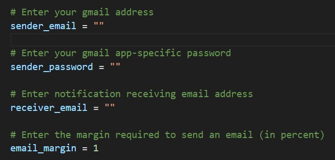

# Arbitrage Checker - Python Application

This application checks 7 crypto exchanges and calculates whether there is an arbitrage opportunity. The application sends an email to the user if a certain arbitrage margin is met.

 

## Requirements
- Python3: [python.org/downloads](https://www.python.org/downloads/)
- Gmail Account: [mail.google.com](https://mail.google.com/)

 

## Installation 
Using the arbitrage checker requires a Gmail app specific password: [support.google.com](https://support.google.com/accounts/answer/185833)

Input each value into the main.py file:

Execute "python3 main.py" to run the sniper.

 

## Continuous Running
Using [PythonAnywhere](https://pythonanywhere.com/), the script can run 24/7 - this is done using the "task" function. 